<!-- animated contribution graph: real data, boxes reveal cell by cell
     (regenerated daily by .github/workflows/update-profile-art.yml) -->

<h3><code>Chi-An-Chen@github ~ $ ./contributions.sh</code></h3>

 
 

<!-- experience/language card (left) + streak/numbers card (right). both svgs are
     840x880; equal percentage widths keep the row centered at every screen size.
     profile:  python scripts/render_profile_svg.py --output avi-ascii.svg --snapshot data/profile-data.json
     stats:    python scripts/render_stats_svg.py (same daily workflow) -->

<h3><code>Chi-An-Chen@github ~ $ work_record</code></h3>

